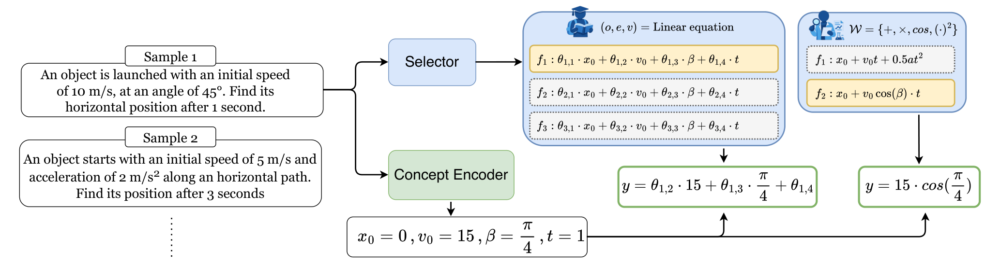

# Mixture of Concept Bottleneck Experts

[Paper](https://arxiv.org/abs/2602.02886)

## TL;DR
Concept Bottleneck Models (CBMs) are inherently interpretable architectures that ground predictions in human-understandable concepts. Nevertheless, existing CBMs fix the task predictor to a single, rigid expression, which limits both accuracy and interpretability. **Mixture of Concept Bottleneck Experts (M-CBEs)** generalizes CBMs along two dimensions: the **number of experts** (specialized functions mapping concepts to the task) and the **functional form** each expert takes. 
We then show how this generalization allows us to instantiate two new concept-based models: **Linear M-CBE (Lin-M-CBE)**, a mixture of learned linear expressions; **Symbolic M-CBE (Sym-M-CBE)**, a mixture of expressions learned through symbolic regression constrained to a user-specified operator vocabulary. Both models achieve a better trade-off between accuracy and interpretability compared to existing concept-based architectures.

## Method



The figure above shows the two instantiations Lin-M-CBE and Sym-M-CBE on a textual input containing questions about physics. The two models share architectural similarities. First, the input is processed by a **Concept Encoder** — which extracts interpretable physical concepts (e.g., $x_0$, $v_0$, $\beta$, $t$). Then, the **Selector** picks the most suitable function (expert) from a pool of $M$ candidate functions $f_1, \ldots, f_M$, which is then evaluated on the predicted concepts to yield the final output $y=f_m(x_0,v_0,\beta, t)$. The linear and symbolic approaches differ in how these functions are built:

**Lin-M-CBE**: each function is a parametric linear function with its own weights $\theta_m$ learned during training. The structure is fixed (linear), and only the weights vary across experts.

**Sym-M-CBE**: each function is a symbolic expression whose operators are constrained by the user. Unlike the linear case, the model discovers both the structure of the expression and its parameters — e.g., $x_0 + v_0 \cos(\beta) \cdot t$.

## Implemented M-CBEs

${\color{lightgreen}\text{Lin-M-CBE}}$: described above.

${\color{lightgreen}\text{Sym-M-CBE}}$: described above. The operator vocabulary is defined at the top of [src/models/sym_m_cbe.py](src/models/sym_m_cbe.py) via the `binary_operators`, `unary_operators`, and `extra_functions` variables. Edit these lists to restrict or expand the set of allowed operators before running an experiment. PySR parameters — including complexity-related settings such as expression depth and number of nodes — can be tuned via the `pysr_params` field in [conf/model/sym_m_cbe.yaml](conf/model/sym_m_cbe.yaml). This is especially useful to control the complexity and readability of the discovered expressions.

${\color{lightgreen}\text{Bool-M-CBE}}$: a variant of Sym-M-CBE designed for binary concept inputs and classification tasks. Each expert is a Boolean logic rule over the predicted concepts. The allowed operators are defined at the top of [src/models/bool_m_cbe.py](src/models/bool_m_cbe.py) via the `boolean_binary_operators` and `boolean_unary_operators` variables. As with Sym-M-CBE, PySR parameters can be configured via the `pysr_params` field in [conf/model/bool_m_cbe.yaml](conf/model/bool_m_cbe.yaml).

${\color{lightgreen}\text{Prior-M-CBE}}$: instead of discovering symbolic expressions from data, this model uses a set of known concept-to-task functions. Only the paramerters of the Selector and Concpet encoder are updated during training. Equations are specified in the dataset config file under the `equations` key as a list of sympy-compatible strings, where concepts are referenced by index (`c0`, `c1`, ...):

```yaml
equations:
  - "c0 + c1 * cos(c2)"
  - "c0 ** 2 - c1"
```

Each entry corresponds to one expert (memory slot).

## Setup

```bash
python setup_environment.py
conda activate m_cbe
```

This script creates the environment, installs dependencies, and pre-initializes Julia packages for PySR.

**Configure environment variables in** `env.py`:

* `HOME` - Path to the project root
* `DATA_PATH` - Path to load datasets
* `PROJECT_NAME` (optional) - Project identifier for logging

## Datasets 
Regression datasets (MNIST-Arithm, dSprites-Exp, Pendulum, MAWPS) are generated or downloaded automatically. Classification datasets require manual setup as described below.

**AWA2.** Download the Animals with Attributes 2 dataset from the [official page](https://cvml.ista.ac.at/AwA2/) and extract it under `{DATA_PATH}/AwA2/`.

**CUB-200.** Download the CUB200 from the [official page](https://worksheets.codalab.org/bundles/0xd013a7ba2e88481bbc07e787f73109f5). Place the resulting files under `{DATA_PATH}/CUB_200_2011/`.

**CIFAR-10 / CIFAR-100.** The image data is downloaded automatically. However, the concept annotation files must be obtained manually from the [Label-free-CBM repository](https://github.com/Trustworthy-ML-Lab/Label-free-CBM/tree/main):
* Download `cifar10_filtered.txt` and `cifar10_classes.txt` and place them in `{DATA_PATH}/cifar10/`
* Download the analogous files for CIFAR-100 and place them in `{DATA_PATH}/cifar100/`

## Running Experiments

To replicate the main experiments from the paper:

1. **Run multiple experiments**:

   ```bash
   python run_sweep.py <specific_config>
   ```

   Where `<specific_config>` is one of the YAML files in the `conf/` directory.

2. **Plot results**:
   Add the result paths to the `paths` list in `show_results.py`, then run:

   ```bash
   python show_results.py
   ```

   Customize `custom_order` and `model_styles` as needed.

## Wandb

To enable Weights & Biases (W&B) logging, set your entity and project in the config:

```yaml
wandb:
  entity: <your_entity>
  project: <your_project>
```

When both fields are provided, training metrics are automatically logged to W&B.

## Citation

If you find this work useful, please cite:

```bibtex
@article{de2026mixture,
  title={Mixture of Concept Bottleneck Experts},
  author={De Santis, Francesco and Ciravegna, Gabriele and De Felice, Giovanni and Casanova, Arianna and Giannini, Francesco and Diligenti, Michelangelo and Zarlenga, Mateo Espinosa and Barbiero, Pietro and Schneider, Johannes and Giordano, Danilo},
  journal={arXiv preprint arXiv:2602.02886},
  year={2026}
}
```